# Backend — AI IT Helpdesk Agent

This is the brain of the project: a FastAPI service that runs the agent, enforces
every safety rule, stores everything, and streams the agent's live reasoning to
the UI. This document explains **how it's built and why**, in detail — the
architecture, the full request flow, the agent loop, the safety machinery, the
data model, and how to run and test it.

**Stack:** Python 3.12+ · FastAPI (async) · SQLAlchemy 2 (async, SQLite) ·
ChromaDB + sentence-transformers for RAG · the Anthropic SDK for Claude.

---

## Table of contents

1. [The core idea](#1-the-core-idea)
2. [System architecture](#2-system-architecture)
3. [How the code is layered (and why)](#3-how-the-code-is-layered-and-why)
4. [The life of a ticket — end to end](#4-the-life-of-a-ticket--end-to-end)
5. [The agent loop in detail](#5-the-agent-loop-in-detail)
6. [The safety model](#6-the-safety-model)
7. [The confidence gate](#7-the-confidence-gate)
8. [Retrieval (RAG) pipeline](#8-retrieval-rag-pipeline)
9. [The ticket state machine](#9-the-ticket-state-machine)
10. [Durable scheduling & the follow-up loop](#10-durable-scheduling--the-follow-up-loop)
11. [The data model](#11-the-data-model)
12. [Live trace over SSE](#12-live-trace-over-sse)
13. [Run it](#13-run-it)
14. [Configuration](#14-configuration)
15. [Tests](#15-tests)
16. [File map](#16-file-map)

---

## 1. The core idea

> **The model proposes, the harness disposes.**

Claude never executes anything by itself. It can only **emit a structured request**
— "I'd like to run `reset_ad_password` for this user." A server-side **executor +
policy engine** then independently decides whether that request is allowed, and
only *then* does the action run, against locked-down mock backends.

Everything in this backend is organized around that one sentence. The language
model is a smart-but-untrusted advisor; every consequential decision (is this
person verified? is this action reversible? does this fix cite a *real* article?
are we confident enough to act?) is made by ordinary, testable Python that the
model cannot talk its way around.

---

## 2. System architecture

A single `uvicorn` process runs three concerns that would be separate services in
production. The **seams** to split them are already in place (the `EventBus`, the
`scheduled_jobs` table, and the `AgentRunner` entry point).

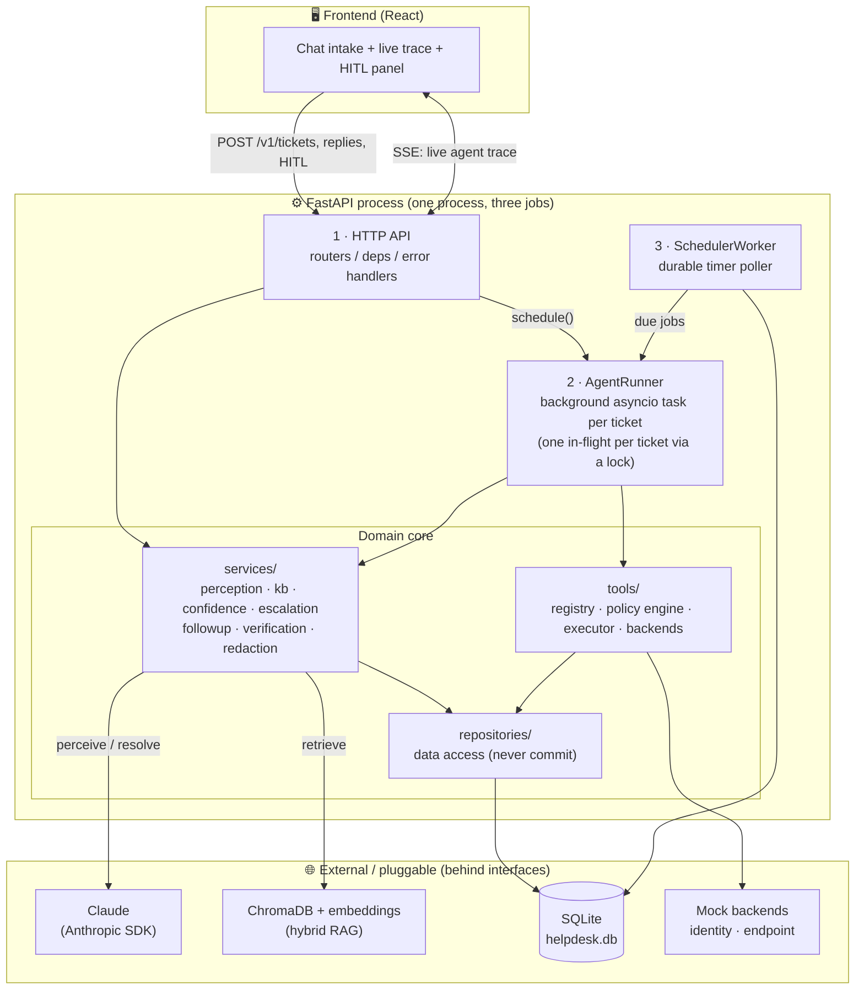

Why one process? It keeps the project trivial to run for a demo. Why does it not
matter for production? Because the agent talks to the outside through an
`EventBus` (→ swap for Redis pub/sub), a `scheduled_jobs` table (→ swap for a real
queue), and a clean `AgentRunner` entry point. Going multi-process is a deployment
change, not a rewrite.

---

## 3. How the code is layered (and why)

The guiding principle is **dependency inversion**: anything touching the outside
world (the LLM, the vector DB, the mock IT systems) sits behind a small interface,
so the core logic depends on the *interface*, not the implementation. That single
decision is what lets the entire agent run in tests with **no network and no API
key**.

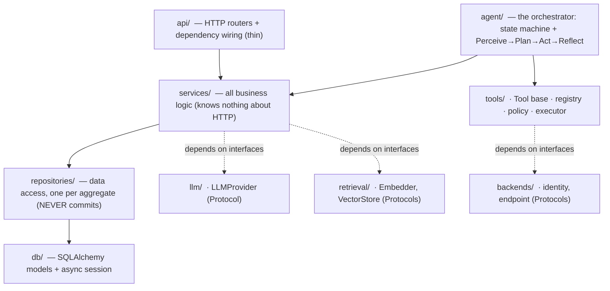

| Layer | Responsibility | Hard rule |
|---|---|---|
| `api/` | Translate HTTP ↔ services. Thin. | No business logic. |
| `services/` | All domain logic. | Knows nothing about HTTP. |
| `repositories/` | Run queries, one per aggregate. | **Never commit** — the caller owns the transaction. |
| `db/` | ORM models + the async session. | — |
| `llm/` `tools/` `agent/` | Cross-cutting toolkits + the orchestrator. | Depend on Protocols, not concretions. |

**What this buys us in practice:**

- **Swappable externals.** `LLMProvider`, `Embedder`, `VectorStore`, and the tool
  `Backends` are all Protocols. Production wires in Claude / ChromaDB / mock AD
  (`main.py`); tests wire in a scripted fake LLM + an offline retriever — *with
  zero changes to the business logic.*
- **Atomic units of work.** Because repositories never commit, the service or
  agent that started the work owns the commit, so a whole step lands or rolls back
  together.
- **New tools don't ripple.** Subclass `Tool`, register it, done. The executor,
  the policy engine, and the loop are untouched (open/closed principle).

The **composition root** is `app/main.py::create_app`. It accepts optional
`provider` / `retriever` overrides and `start_scheduler` / `seed` flags — that's
the single place where real-vs-fake implementations are chosen.

---

## 4. The life of a ticket — end to end

A request has two halves: a **fast synchronous intake** (so the user gets an
instant answer) and a **slow background agent run** that the UI watches live.

```mermaid
sequenceDiagram
    autonumber
    participant U as User (UI)
    participant API as FastAPI router
    participant TS as TicketService
    participant DB as SQLite
    participant R as AgentRunner (bg task)
    participant LLM as Claude
    participant KB as Hybrid RAG
    participant EX as Executor + Policy
    participant BUS as EventBus → SSE

    U->>API: POST /v1/tickets {body}
    API->>TS: create_ticket()
    TS->>TS: redact PII/secrets · detect injection
    TS->>TS: dedup (word-set hash)
    TS->>DB: persist ticket + first message
    API-->>U: 202 Accepted (ticket_id)
    API->>R: schedule(ticket_id, "intake")

    Note over R: ── background run starts ──
    R->>LLM: PERCEIVE (forced classify_ticket)
    LLM-->>R: category, urgency, impact, flags, entities
    R->>DB: set priority + SLA; status=in_progress
    R->>KB: PLAN — hybrid retrieve (dense+BM25+RRF)
    KB-->>R: hits + confidence + no_good_match

    loop ACT — tool-use loop (max steps / cost ceiling)
        R->>LLM: messages + tool defs
        LLM-->>R: tool_use OR finalize_resolution
        alt tool_use
            R->>EX: execute(tool, args)
            EX->>EX: resolve identity · run policy · idempotency
            EX-->>R: result (ran / denied / parked)
            R->>BUS: emit tool_call, policy, tool_result
        else finalize / end_turn
            R->>R: leave loop
        end
    end

    Note over R: ── REFLECT (code decides, not the model) ──
    R->>R: grounding check + confidence gate
    alt resolve
        R->>DB: status=resolved · schedule follow-up
    else escalate
        R->>DB: build handover · route to a queue
    else await
        R->>DB: status=awaiting_user / _verification / _approval
    end
    R->>BUS: emit run_finished
    BUS-->>U: live events throughout
```

### Phase 0 — Intake (synchronous, returns in milliseconds)

`POST /v1/tickets` → `TicketService.create_ticket` does the bare minimum to
respond fast, then gets out of the way:

| Step | What | Why |
|---|---|---|
| **Redact** | `RedactionService` strips secrets/PII *before storage* and flags injection phrasing. | Nothing sensitive is ever persisted; injection is caught at the door. |
| **Dedup** | A sorted word-set MD5 hash; a recent identical ticket from the same user returns the original. | Stops accidental double-submits from spawning two runs. |
| **Persist** | Save the ticket + first user message. | — |
| **202 + schedule** | Return `202 Accepted` and fire the background run. | The slow agent work never blocks the HTTP response. |

Intake deliberately has **no dependency on the agent** (avoids import cycles and
keeps the path fast). It just drops a ticket and rings the bell.

### Phases 1–4 — the background run (`AgentRunner._execute`)

| Phase | What happens | Key files |
|---|---|---|
| **PERCEIVE** | One Claude call with *forced* `classify_ticket` tool-use → structured category, urgency, impact, sentiment, entities, language, and injection/security flags. Priority is then **recomputed server-side** from urgency × impact (a hallucinated "P1" can never jump the queue). | `services/perception_service.py`, `core/constants.py` |
| **PLAN** | Hybrid RAG search of the KB; records retrieval confidence and the crucial `no_good_match` flag. | `services/kb_service.py`, `services/retrieval/` |
| **ACT** | The Claude tool-use loop. The model reads grounded context and calls tools one at a time — every call through the executor + policy engine. | `agent/loop.py`, `tools/` |
| **REFLECT** | **The runner, not the model**, validates grounding, runs the confidence gate, and disposes: resolve / escalate / await. | `agent/runner.py`, `services/confidence_service.py` |

---

## 5. The agent loop in detail

This is `AgentLoop.run`. The model gets a context block containing the ticket
facts, the conversation, **the retrieved KB articles as the only allowed source of
truth**, and the ticket text **fenced as untrusted data**. Then it loops, reacting
to Claude's `stop_reason`:

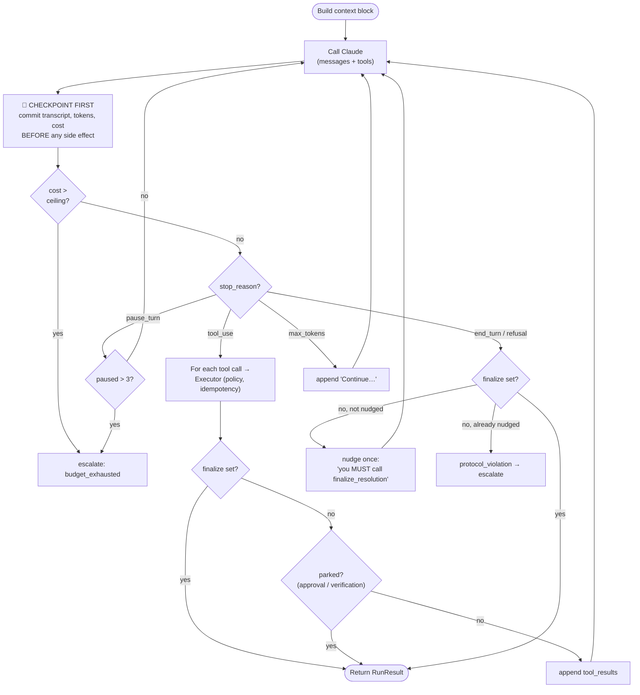

> The whole loop is bounded by `AGENT_MAX_STEPS`: if it runs that many turns
> without finalizing, it exits and escalates with `budget_exhausted`.

**Safety bounds wrapping the loop:**

| Bound | Mechanism | Effect |
|---|---|---|
| Runaway steps | `AGENT_MAX_STEPS` | Loop exits → escalate. |
| Runaway spend | `AGENT_COST_CEILING_CENTS` (cost metered per turn) | Over budget → escalate. |
| Crash mid-action | **Checkpoint before side effects** + idempotency keys | A resumed run replays tool calls as no-ops. |
| Model won't finish | One nudge, then forced low-confidence escalation | No silent hangs. |
| No-progress spin | `pause_turn` guard + oscillation detection | Bails out safely. |

The loop ends only when the model calls `finalize_resolution` (parsed into a
structured object), asks to escalate, or a tool **parks** the ticket for approval
/ verification.

---

## 6. The safety model

Every single tool call goes through `ToolExecutor.execute` — the place where
"propose" becomes "dispose". For each call it:

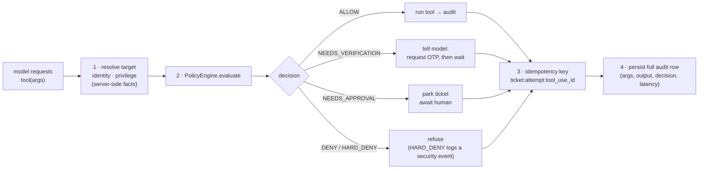

Identity/privilege are resolved **before** the policy runs, which keeps the policy
engine a pure function (trivially testable). The idempotency key is **always
derived by the harness** — a model-supplied key is never trusted — so a replayed
call returns the stored result instead of acting twice.

### The policy engine (default-deny, safety-first)

`PolicyEngine.evaluate` is pure decision logic. Rules are checked
**safety-gates-first, first-match-wins:**

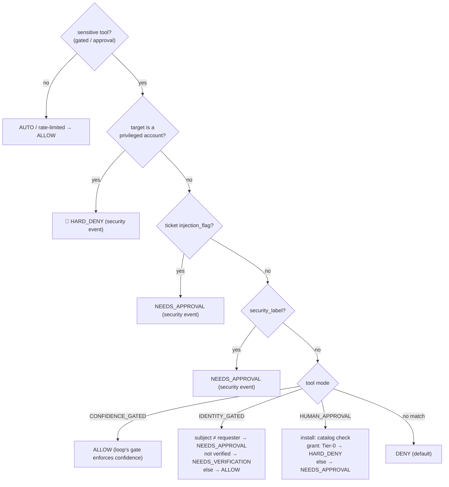

Because the engine reads only **server-side context**, no amount of clever ticket
text can change its mind. That is the whole point.

### The tool catalog

Tools declare a **`mode`** that tells the policy engine how to treat them by
default. This is the entire authorization surface:

| Tool | Mode | Reversible | What it does |
|---|---|---|---|
| `search_kb` | `AUTO` | — | Search the KB; records cited ids for grounding. |
| `check_account_status` | `AUTO` | — | Read account status (locked, MFA, expiry). |
| `run_endpoint_diagnostic` | `AUTO` | — | Read-only device diagnostic (vpn/connectivity/disk). |
| `send_user_message` | `AUTO_RATE_LIMITED` | — | Message the user (≤5 per run). |
| `update_ticket` | `AUTO` | — | Internal working note. |
| `request_identity_verification` | `AUTO` | — | Start an OTP challenge (safe; the *use* is gated). |
| `unlock_account` | `CONFIDENCE_GATED` | ✔ | Unlock an account (privileged-target guard still applies). |
| `reset_ad_password` | `IDENTITY_GATED` | ✔ | Reset AD password; needs a verified, single-use token. |
| `install_software` | `HUMAN_APPROVAL` | ✔ | Install from an approved catalog; needs a human. |
| `grant_access_request` | `HUMAN_APPROVAL` | ✔ | Grant a resource; **Tier-0 is hard-denied**; requester-only. |
| `escalate_to_human` | `AUTO` | — | Hand off (always permitted — the fail-safe direction). |
| `finalize_resolution` | `AUTO` | — | End the run with a structured result (called once). |

A few deliberate design choices worth calling out:

- **`grant_access_request` has no `subject` field** — access is *always* granted to
  the requester, so a poisoned ticket can't redirect a grant to another account.
- **Identity tokens are single-use** — `reset_ad_password` consumes the token the
  moment it succeeds, so one verification authorizes exactly one action.
- **An approved action is re-checked** — even after a human approves, the executor
  re-runs the policy; a human still cannot approve a Tier-0 grant or a
  privileged-account change.

### The five defenses, by example

| Risk | Defense | Where |
|---|---|---|
| Tricked into a harmful action | Default-deny policy on server-side facts | `tools/policy.py` |
| Confidently invented fix | Grounding contract: cited `kb_id` must be in the retrieved set | `agent/runner.py` |
| Reset the *wrong* account | Single-use, subject-bound OTP; cross-subject → approval | `services/verification_service.py` |
| Irreversible action | Reversibility tiers; install/grant park for approval; Tier-0 never automated | `tools/` |
| PII / secret leakage | Redaction at ingress + on persisted messages | `services/redaction_service.py` |

---

## 7. The confidence gate

The model reports how confident it is — and **we never trust that number alone.**
`ConfidenceService.calibrate` starts from the model's self-rating, applies
independent adjustments the model can't fake, then routes the result into a zone.

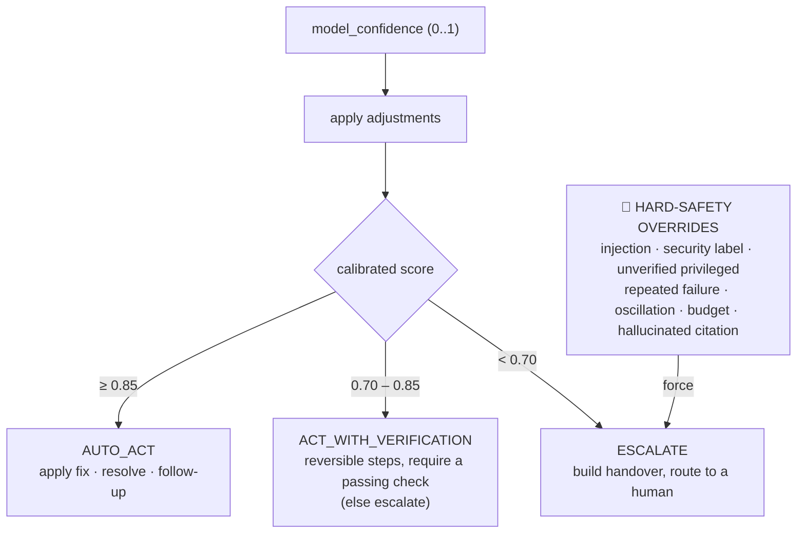

**The adjustments** (each is also a recorded reason, so a human can see *why*):

| Signal | Effect on score |
|---|---|
| No KB citation | capped at **0.55** |
| Each failed tool | **−0.25** |
| Unmatched symptoms | **−0.15** |
| Priority is P1 | **−0.10** (bias toward a human) |
| Genuine `no_good_match` | capped at **0.40** |

And a set of **hard-safety reasons bypass the number entirely** and force
escalation no matter how high the score: prompt injection, a security label, a
privileged action without verified identity, repeated tool failure, detected
oscillation, budget exhaustion, or a hallucinated citation.

The gate is intentionally **asymmetric — when in doubt, it hands off to a human.**
A clarification (`needs_user`) is only honored if the ticket isn't otherwise being
escalated.

---

## 8. Retrieval (RAG) pipeline

`HybridRetriever.search` combines two complementary search strategies so we catch
both paraphrases *and* exact terms, then fuses them robustly.

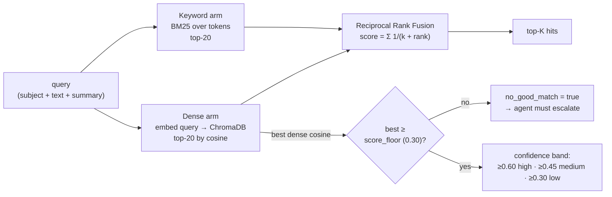

**Why this design:**

- **Dense** embeddings catch meaning ("can't get online" ≈ "no internet").
- **BM25** catches exact tokens embeddings miss (error codes, product names).
- **RRF** fuses the two *rankings* — no need to calibrate their raw scores against
  each other, which is notoriously fragile.
- **The `no_good_match` gate is anchored on the best *dense* cosine** — an
  absolute, comparable signal. When the best match is below the floor, the agent
  is told there is no usable article and **must escalate instead of inventing a
  fix.** This is the anti-hallucination tripwire.

> **Offline fallback:** if sentence-transformers / ChromaDB aren't available, the
> `retrieval/factory.py` swaps in a deterministic hashing embedder + in-memory
> store, so the app (and the whole test suite) runs with no model download.

---

## 9. The ticket state machine

Ticket status is governed by **one** state machine (`agent/state_machine.py`). No
layer can move a ticket into an illegal state — `assert_can_transition` raises a
`ConflictError`. The agent loop runs **only** while a ticket is `in_progress`;
everything else is deterministic Python we own, which keeps the system replayable.

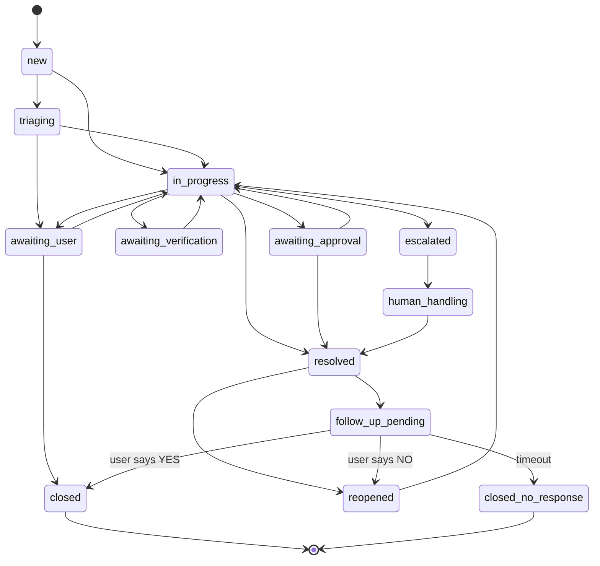

Note the two distinct terminal states: **`closed`** (the user confirmed it works)
versus **`closed_no_response`** (we never heard back). They are kept separate so
silence is never counted as a confirmed success.

---

## 10. Durable scheduling & the follow-up loop

A resolution isn't real until the user confirms it. On every resolve, the runner
writes a durable job to the **`scheduled_jobs`** table. The `SchedulerWorker`
polls that table, **leases due jobs exactly-once**, and dispatches them.

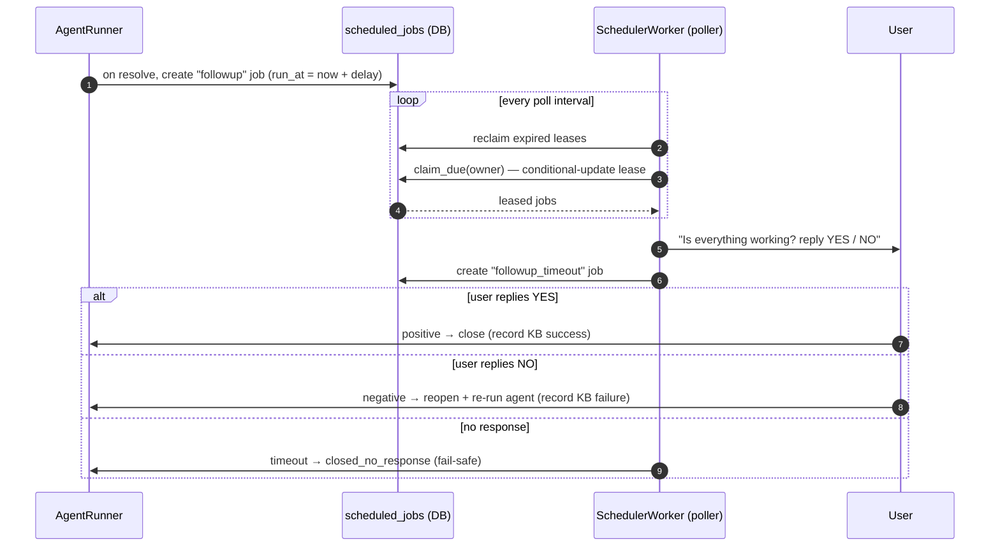

**Why a DB table and not an in-memory timer?** Durability. Timers survive a
restart, and the **`UNIQUE` idempotency key + lease** gives exactly-once execution
even if several pollers run. The same mechanism powers **approval timeouts** — an
unanswered approval **fails closed** (escalates), it never auto-executes.

The reply classifier (`classify_reply`) does word-level matching and **errs toward
"not resolved"** — any negative word reopens the ticket.

---

## 11. The data model

`agent_runs` + `tool_calls` + `agent_events` together form an **immutable audit
trail** that lets an operator replay any agent decision.

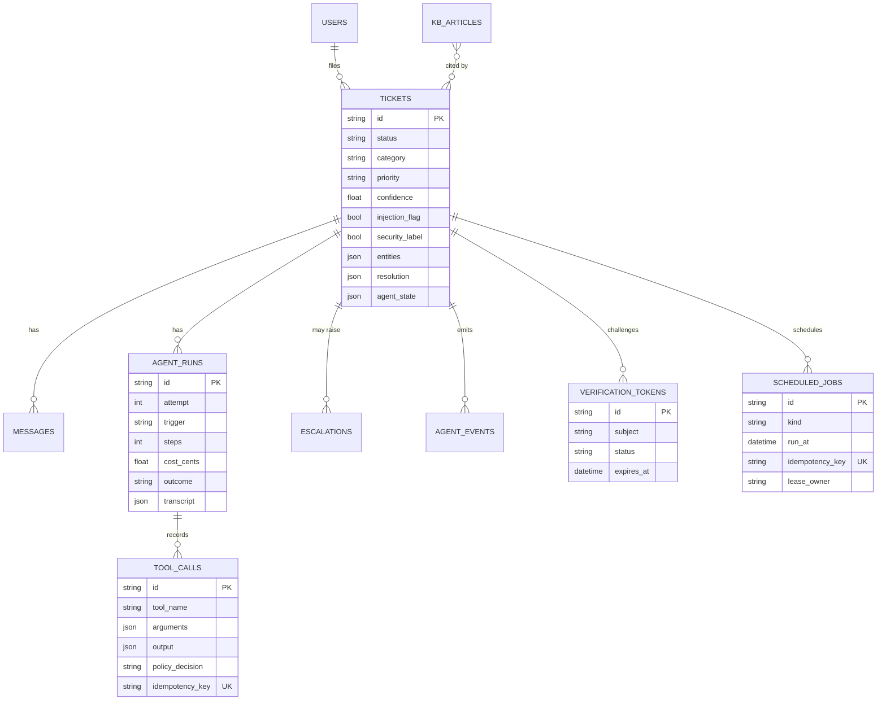

| Table | Role |
|---|---|
| `tickets` | The aggregate: state, perception output, confidence, safety flags, resolution snapshot. |
| `messages` | The conversation (user / agent / human / system); bodies are PII-redacted. |
| `agent_runs` | One per attempt: trigger, steps, token usage, cost, outcome, checkpointed transcript. |
| `tool_calls` | Every tool invocation with its policy decision + a **unique** idempotency key. |
| `escalations` | The structured, immutable handover package + routing queue. |
| `scheduled_jobs` | The single durable timer mechanism (follow-ups, timeouts) with lease + idempotency key. |
| `verification_tokens` | Subject-bound, short-TTL, single-use OTP tokens. |
| `agent_events` | Append-only event log per ticket — powers SSE replay. |
| `kb_articles` | The knowledge base (embedded + BM25-indexed); tracks success rate. |

### Derived values (computed, never trusted from the model)

**Priority** = a fixed matrix of urgency × impact, recomputed server-side:

| | Individual | Team | Org |
|---|---|---|---|
| **Critical** | P2 | P1 | P1 |
| **High** | P3 | P2 | P1 |
| **Medium** | P3 | P3 | P2 |
| **Low** | P4 | P4 | P3 |

**SLA target** (minutes to first attempt): P1 = 15 · P2 = 60 · P3 = 240 · P4 = 1440.

**Escalation routing** (`route_queue`): a security label → `security`; a P1 →
`major-incident`; otherwise by category (e.g. password/MFA/lockout →
`identity-access`, VPN/network → `network-ops`, software/performance →
`endpoint`).

---

## 12. Live trace over SSE

Every meaningful step is emitted **twice**: persisted to `agent_events` (durable,
replayable) *and* published to an in-process `EventBus` keyed by ticket id. The
SSE endpoint subscribes first, **replays the saved backlog** so a late viewer
misses nothing, then streams live — all **de-duplicated by sequence number**.

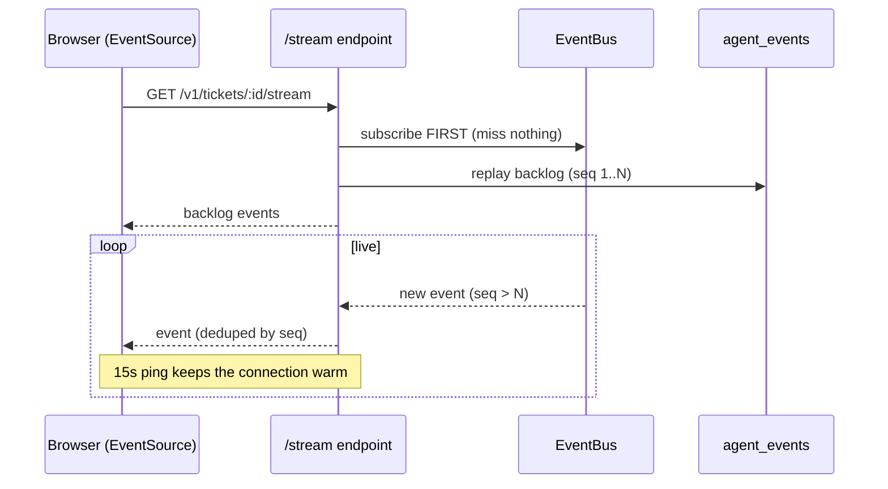

Event kinds: `run_started`, `phase`, `thought`, `tool_call`, `tool_result`,
`policy`, `state_change`, `confidence`, `escalated`, `resolved`, `awaiting`,
`error`, `run_finished`. Swapping the `EventBus` for Redis pub/sub is the only
change needed to make this work across processes.

---

## 13. Run it

```bash
python -m venv .venv && .venv\Scripts\activate
pip install -r requirements.txt
copy .env.example .env          # set ANTHROPIC_API_KEY (+ ANTHROPIC_BASE_URL for Azure/Foundry)
uvicorn app.main:app --reload
```

- API docs (Swagger): http://localhost:8000/docs
- Liveness: `GET /healthz` · Readiness (DB + LLM config + KB index): `GET /readyz`

On first start it downloads a small embedding model (~80 MB) and seeds the KB
articles + demo users into `helpdesk.db`. If the embedding stack is unavailable it
falls back to the offline hashing retriever automatically.

### The HTTP surface

| Method & path | Purpose |
|---|---|
| `POST /v1/tickets` | Create a ticket (redact → dedup → 202 + background run). |
| `GET /v1/tickets` | List/filter tickets (paged). |
| `GET /v1/tickets/{id}` | Ticket detail + conversation. |
| `GET /v1/tickets/{id}/runs` | Run history + per-call tool trace (the audit view). |
| `GET /v1/tickets/{id}/stream` | **SSE** live agent trace. |
| `POST /v1/tickets/{id}/messages` | User reply (drives clarify / follow-up / re-run). |
| `POST /v1/tickets/{id}/verify` | Submit an OTP code. |
| `POST /v1/tickets/{id}/approve` | Approve / deny a parked action. |
| `POST /v1/tickets/{id}/hitl` | Operator overrides (take over / force-resolve / force-escalate / reply). |
| `GET /v1/tickets/{id}/escalation` | The handover package. |

---

## 14. Configuration (`.env`)

| Key | Purpose |
|---|---|
| `ANTHROPIC_API_KEY` | **Required** to run the agent. If empty, the API still starts and runs fail with a clear message (so the UI can warn you). |
| `ANTHROPIC_BASE_URL` | Set for Azure AI Foundry / a proxy endpoint. |
| `LLM_MODEL` | The Claude model for both perception and resolution (default `claude-sonnet-4-6`). |
| `LLM_ENABLE_PROMPT_CACHE` | Cache the stable system + tools prefix (cheaper, faster). |
| `LLM_MAX_RETRIES` / `LLM_TIMEOUT_SECONDS` | SDK resilience knobs. |
| `CONFIDENCE_AUTO_THRESHOLD` / `CONFIDENCE_VERIFY_THRESHOLD` | The gate bands (defaults `0.85` / `0.70`). |
| `AGENT_MAX_STEPS` / `AGENT_COST_CEILING_CENTS` / `AGENT_MAX_ATTEMPTS` | Loop safety budgets. |
| `FOLLOWUP_DELAY_SECONDS` | `7200` (2 h) in prod; set ~`20` for a live demo. |
| `OTP_DEMO_CODE` | A fixed demo OTP so the identity flow completes without a real second factor. |
| `EMBEDDING_MODEL` / `CHROMA_PATH` / `RAG_TOP_K` / `RAG_SCORE_FLOOR` | Retrieval model, persistence dir, and tuning. |

> **Note:** perception and resolution use the **same configured model**. The forced
> `classify_ticket` schema keeps perception cheap and reliable rather than relying
> on a separate smaller model tier.

**Performance levers:** prompt caching on the stable system+tools prefix; a
**stable, name-sorted tool-definition order** so the cache prefix stays valid; and
`temperature=0.0` for deterministic perception/resolution.

---

## 15. Tests

```bash
pytest                      # full suite; no network or API key needed
pytest tests/unit           # confidence, redaction, policy, state machine, retriever, perception
pytest tests/integration    # tools/executor, full agent flows, follow-up, the HTTP API
```

Tests inject a **scripted `FakeLLM`** (implementing `LLMProvider`) plus an offline
hashing retriever, so the entire Perceive→Plan→Act→Reflect loop — the policy
engine, identity gate, escalation, follow-up — runs **deterministically and
offline.** Representative scenarios:

| Scenario | Asserts |
|---|---|
| VPN ticket → grounded auto-resolve | Diagnostic + cited fix, resolved, follow-up scheduled. |
| Password reset → OTP → resolve | Identity gate blocks until a verified, single-use token exists. |
| Prompt injection / privileged target | Blocked by policy, escalated to the security queue. |
| No-KB-match / hallucinated citation | Forced escalation (no improvised fix). |
| `install_software` → approval | Parks, then completes on human approval. |
| Follow-up positive / negative / silent | Close / reopen / `closed_no_response`. |
| Executor idempotency | A replayed tool call is a no-op. |

---

## 16. File map

```
app/
├── core/          enums/constants (the shared vocabulary), exceptions, logging, ids
├── config.py      typed settings (pydantic-settings)
├── db/            SQLAlchemy base, async session, ORM models
├── schemas/       Pydantic data shapes (API + domain)
├── repositories/  data access, one per aggregate (never commit)
├── llm/           LLMProvider Protocol · Anthropic adapter · prompts
├── services/      perception · kb · confidence · escalation · followup ·
│                  verification · redaction · notification (SSE bus) ·
│                  retrieval/ (embedder · vector store · hybrid retriever)
├── tools/         Tool base · registry · policy engine · executor · mock backends
├── agent/         state machine · the Perceive→Plan→Act→Reflect runner · loop · events
├── api/           routers · deps · error handlers
├── workers/       the durable scheduler poller
├── seed/          KB articles (YAML) + demo users
└── main.py        app factory + lifespan (the composition root)
```

| Want to understand… | Start here |
|---|---|
| How a run is orchestrated + disposed | `app/agent/runner.py` |
| The Claude tool-use loop | `app/agent/loop.py` |
| The authorization rules | `app/tools/policy.py` |
| Where propose→dispose happens | `app/tools/executor.py` |
| The confidence calibration | `app/services/confidence_service.py` |
| Ticket classification | `app/services/perception_service.py` |
| Hybrid RAG | `app/services/retrieval/retriever.py` |
| Durable timers | `app/workers/scheduler.py` |
| Where everything is wired together | `app/main.py` |
